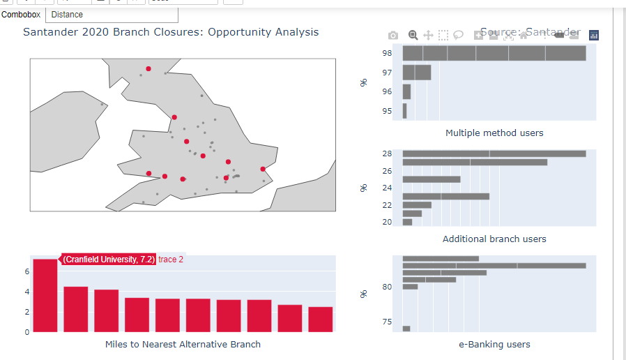

# [Project 3: Santander 2020 Branch Closures](https://github.com/mthorp363/santander_branch_closures/blob/master/Closures_2020.ipynb)
## Executive summary

*Please note, for the plotly visualisation to work, the notebook and datasets need to be downloded and run. The widget information is saved in the metadata and can be viewed at the end of the notebook. Screenshots of the visualisation running can be seen below. Alternatively, the Tableau version can be found below*

Santander's 2020 branch closures are in Universities around England, Scotland, Northern Ireland and Wales, leading to the opportunity for targeted marketing within the area, both online and offline. The aim of this project is to identify specific areas where marketing efforts can be best targeted to obtain customers based on the information provided by Santander (distance to nearest alternative branch, customers who use a variety of ways to bank, customers who already use an additional branch, customers who already use e-Banking services). From this information, the following three locations had entries in the top 10 for three of the four categories:

- Cranfield University
- Cardiff Metropolitan University
- University of Plymouth

Important areas which were geographically clustered which were rated as important were:

- London
- Bath
- Birmingham/West Midlands
Other important insights from the exploratory data analysis:

- Customers who use a variety of ways to bank and customers who use online banking have the strongest correlation.
- Longitudes and customers who use a variety of ways to bank have a slight correlation, indicating there is a regional east/west difference in which services are used.

## Visualisation

Two versions were created, the plotly version requires the workbook and datasets to be downloaded and the Tableau version can be viewed online.

### Tableau Version:

<noscript></noscript><object class='tableauViz'  style='display:none;'><param name='host_url' value='https%3A%2F%2Fpublic.tableau.com%2F' /> <param name='embed_code_version' value='3' /> <param name='site_root' value='' /><param name='name' value='Santander2020BranchClosures&#47;Dashboard1' /><param name='tabs' value='no' /><param name='toolbar' value='yes' /><param name='static_image' value='https:&#47;&#47;public.tableau.com&#47;static&#47;images&#47;Sa&#47;Santander2020BranchClosures&#47;Dashboard1&#47;1.png' /> <param name='animate_transition' value='yes' /><param name='display_static_image' value='yes' /><param name='display_spinner' value='yes' /><param name='display_overlay' value='yes' /><param name='display_count' value='yes' /><param name='language' value='en-GB' /></object>
          

### Plotly Version:

The visualisation's information is displayed in the cursor hover info, as seen in the two visualisations below.

The combobox widget allows users to focus on information which is important to them.

"Distance"

.png "Distance")

"Multi-method users"

.png "Multi-method users")

"Multi-branch users"

.png "Multi-branch users")

"e-Banking users"

.png "e-Banking users")

The data was copied from [Santander](https://www.santander.co.uk/personal/support/ways-to-bank/our-branches) and entered into an excel file. Latitudes and Longitudes were obtained from [gridreferencefinder.com](https://gridreferencefinder.com/batchConvert/batchConvert.php) and were entered into a different excel file.

